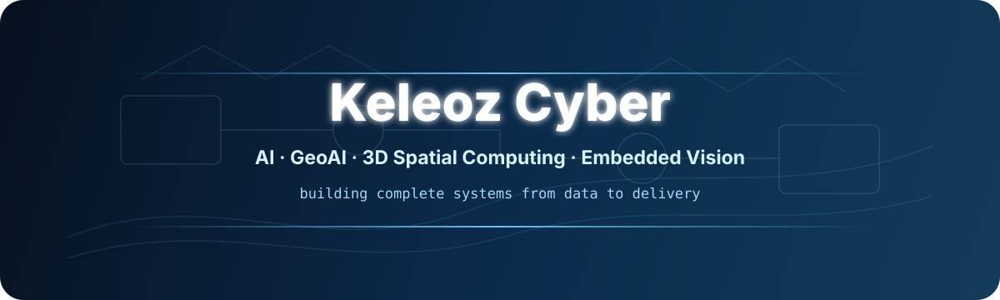

<!-- Profile README for Keleoz-Cyber -->

<div align="center">



<h1>Hi, I'm Keleoz 👋</h1>

<p>
  <b>Computer Science Undergraduate · AI / LLM · GeoAI & 3D Spatial Computing · Embedded Vision</b>
</p>

<p>
  <code>Python</code> ·
  <code>C++</code> ·
  <code>Java</code> ·
  <code>TypeScript</code> ·
  <code>Vue 3</code> ·
  <code>FastAPI</code> ·
  <code>PyTorch</code> ·
  <code>SuperMap3D</code>
</p>

<p>
  
</p>

<p>
  <a href="https://github.com/Keleoz-Cyber?tab=repositories">
    
  </a>
  <a href="https://github.com/Keleoz-Cyber/SuperMap2026">
    
  </a>
  <a href="https://github.com/Keleoz-Cyber/LessonSearch">
    
  </a>
</p>

<p>
  我关注 AI、大模型工程、三维空间计算与智能系统开发。<br/>
  比起只完成一个算法 Demo，我更喜欢把数据、算法、后端、前端、可视化、验证和交付连成一个真正可运行的系统。
</p>

</div>

---

## 00 · About Me

我是一名计算机相关专业本科生，目前主要学习和实践 **AI / LLM Engineering、GeoAI、三维空间建模、计算机视觉与嵌入式智能系统**。

我的兴趣正在从“掌握单项技术”转向“构建完整系统”：从原始数据接入开始，经过清洗、建模、验证、服务化和可视化，最后形成能够被真实使用、演示和复现的工程成果。

我尤其关注：

- **AI & LLM Engineering**：RAG、模型调用、评估、Agent 工作流与 AI 辅助分析
- **GeoAI & 3D Spatial Computing**：三维地质属性建模、空间插值、空间验证、体渲染与切片分析
- **Machine Learning**：随机森林、图像分类、空间回归、模型比较与误差分析
- **Embedded Vision**：单片机、嵌入式视觉、串口通信与边缘 AI
- **Software Engineering**：前后端分离、API、数据持久化、自动化测试、CI 与可交付工程

> Build complete systems. Validate results. Make complex things understandable.

---

## 01 · Current Focus

```text
AI / LLM Engineering       RAG · Agent Workflow · Evaluation · AI-assisted Analysis
GeoAI / 3D Modeling        Spatial Interpolation · Kriging · Random Forest · 3D Attribute Fields
3D Visualization           SuperMap3D · NetCDF · Volume · Contour · X/Y/Z Slice
Full-stack Engineering     Python · FastAPI · Vue 3 · TypeScript · SQLite / MySQL
Embedded & Vision          C / C++ · MCU · UART · Edge Vision · Computer Vision
CS Foundations             Data Structures · Operating Systems · Computer Networks · Algorithms
```

---

## 02 · Featured Projects

### 🧊 [SuperMap2026 — GeoModelingPlatform](https://github.com/Keleoz-Cyber/SuperMap2026)

浏览器端 **三维地质属性建模与智能分析平台**。项目把数据接入、质量检查、多算法建模、空间交叉验证、三维成果生成、SuperMap3D 体渲染、统计分析、规则研判与可选 AI 辅助解释串成完整闭环。

**Highlights**

- IDW / Ordinary Kriging / DSI-like / Random Forest / Kriging-RF
- 整 XY 柱空间交叉验证与候选模型比较
- 三维属性场物化与 NetCDF 输出
- SuperMap3D Volume / Contour / X-Y-Z Slice
- FastAPI + Vue 3 + TypeScript + ECharts
- SQLite 持久化、测试、CI、Windows 免安装交付
- 确定性规则优先，AI 仅作为可选辅助解释

`Python` `FastAPI` `Vue 3` `TypeScript` `scikit-learn` `SuperMap3D` `NetCDF` `ECharts`

---

### 📱 [LessonSearch](https://github.com/Keleoz-Cyber/LessonSearch)

面向课程查询、点名、名单汇总与审核场景的移动端工具，包含 App、后端服务、数据库与部署链路。

`Flutter` `FastAPI` `MySQL` `Docker` `Nginx`

---

### 🧠 [ds-ai-quiz](https://github.com/Keleoz-Cyber/ds-ai-quiz)

数据结构智能刷题与错题推荐系统，将哈希表、堆、图遍历等课程知识组织为一个可运行的 C++ 项目，并加入题目管理、记录与推荐逻辑。

`C++` `Data Structures` `Hash Map` `Heap` `Graph` `CSV`

---

### 📊 [Mathematical_Modeling](https://github.com/Keleoz-Cyber/Mathematical_Modeling)

数学建模训练、算法实验、数据分析和论文流程沉淀，用于持续训练把现实问题抽象成模型并进行验证与表达的能力。

`Python` `Modeling` `Optimization` `Data Analysis` `Documentation`

---

### ☕ [HAUT_Survivor](https://github.com/Keleoz-Cyber/HAUT_Survivor)

Java 与 Web 开发实践项目，用于训练后端业务逻辑、数据库与页面交互等完整开发流程。

`Java` `Web` `SQL`

---

## 03 · Engineering Stack

<table>
  <tr>
    <td width="22%"><b>Languages</b></td>
    <td>
      <code>Python</code>
      <code>C++</code>
      <code>C</code>
      <code>Java</code>
      <code>TypeScript</code>
      <code>JavaScript</code>
      <code>Dart</code>
      <code>SQL</code>
    </td>
  </tr>
  <tr>
    <td><b>AI / ML</b></td>
    <td>
      <code>PyTorch</code>
      <code>scikit-learn</code>
      <code>Random Forest</code>
      <code>Image Classification</code>
      <code>RAG</code>
      <code>LLM API</code>
      <code>Evaluation</code>
    </td>
  </tr>
  <tr>
    <td><b>Geo / 3D</b></td>
    <td>
      <code>SuperMap3D</code>
      <code>Spatial Interpolation</code>
      <code>Kriging</code>
      <code>NetCDF</code>
      <code>3D Volume</code>
      <code>QGIS</code>
      <code>Remote Sensing</code>
    </td>
  </tr>
  <tr>
    <td><b>Frontend / Backend</b></td>
    <td>
      <code>Vue 3</code>
      <code>TypeScript</code>
      <code>Element Plus</code>
      <code>ECharts</code>
      <code>FastAPI</code>
      <code>Flutter</code>
    </td>
  </tr>
  <tr>
    <td><b>Data / Infra</b></td>
    <td>
      <code>SQLite</code>
      <code>MySQL</code>
      <code>NumPy</code>
      <code>pandas</code>
      <code>SciPy</code>
      <code>Docker</code>
      <code>Nginx</code>
      <code>Linux</code>
    </td>
  </tr>
  <tr>
    <td><b>Engineering</b></td>
    <td>
      <code>Git</code>
      <code>GitHub Actions</code>
      <code>pytest</code>
      <code>Vitest</code>
      <code>Playwright</code>
      <code>VS Code</code>
      <code>JetBrains</code>
    </td>
  </tr>
</table>

---

## 04 · How I Build

```text
Problem
  ↓
Data & Domain Understanding
  ↓
Cleaning / Mapping / Quality Control
  ↓
Algorithm & Model Design
  ↓
Validation & Error Analysis
  ↓
Backend Service / Persistence
  ↓
Frontend & Visualization
  ↓
Testing / Packaging / Delivery
```

我希望每个项目最终都能回答四个问题：

1. **为什么这样设计？**
2. **结果是否可信？**
3. **系统能否稳定运行？**
4. **别人能否理解、复现并使用？**

---

## 05 · Learning Roadmap

目前持续补强的方向：

- 大模型基础、Transformer、RAG、Agent 与模型评估
- 数据结构、算法、操作系统、计算机网络与计算机组成原理
- Python / C++ 工程能力与高质量代码实践
- 机器学习与深度学习训练、验证和部署
- 三维空间数据结构、空间统计与 GeoAI
- MCU、嵌入式开发、计算机视觉与边缘智能

---

## 06 · GitHub Overview

<div align="center">


</div>

---

## 07 · Contribution Trace

<div align="center">

<picture>
  <source media="(prefers-color-scheme: dark)" srcset="https://raw.githubusercontent.com/Keleoz-Cyber/Keleoz-Cyber/output/github-contribution-grid-snake-dark.svg">
  <source media="(prefers-color-scheme: light)" srcset="https://raw.githubusercontent.com/Keleoz-Cyber/Keleoz-Cyber/output/github-contribution-grid-snake.svg">
  
</picture>

</div>

---

## 08 · Beyond Code

除了工程与算法，我也喜欢技术写作、信息设计和带有科幻 / Cyber 气质的创作。

我喜欢研究复杂系统如何被组织、解释与可视化，也喜欢把 **技术、空间、记忆、身份与未来感** 放进作品里。

对我来说，代码解决问题，模型解释数据，而好的表达让复杂系统真正被人理解。

---

## 09 · Contact

- GitHub: [`Keleoz-Cyber`](https://github.com/Keleoz-Cyber)
- Blog: `keleoz.cn`

---

<div align="center">

<b>AI · GeoAI · 3D Spatial Computing · Embedded Vision · Software Engineering</b>

<br/>
<br/>

<sub>Keep building. Keep validating. Keep learning.</sub>

</div>
