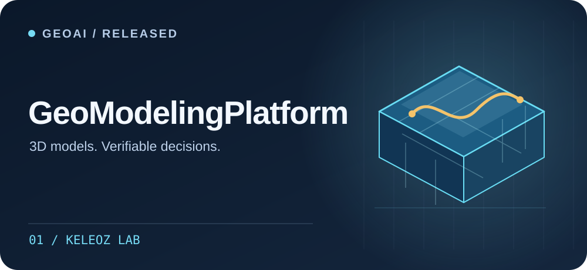
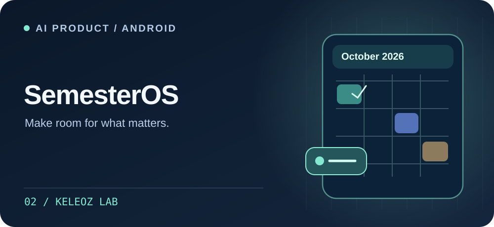
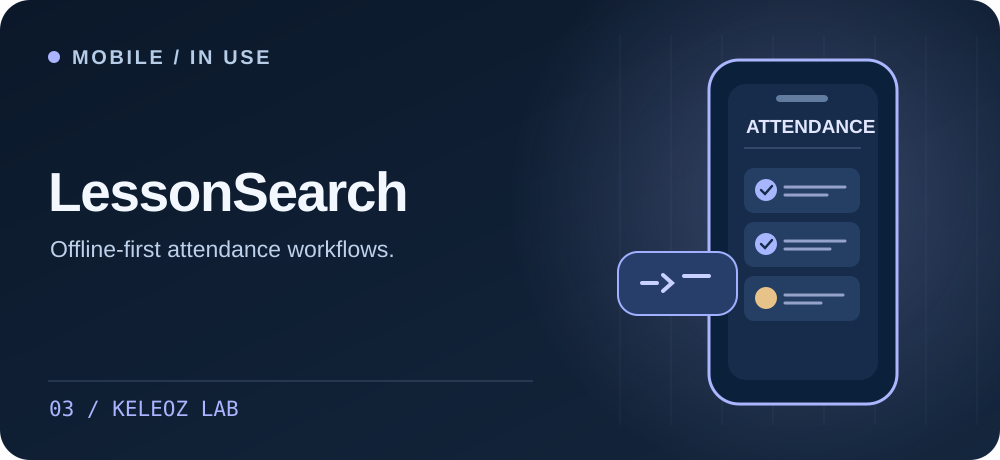
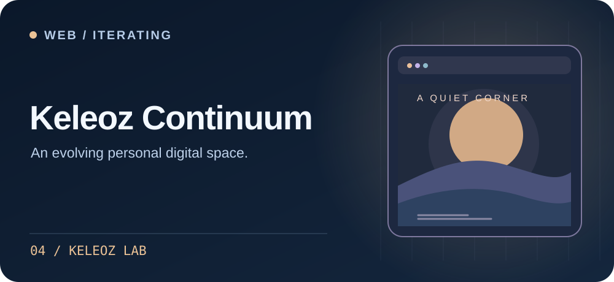
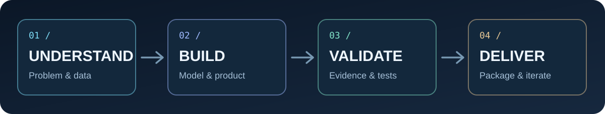

<!-- Profile README · Keleoz-Cyber · Updated October 2026 -->

  

  <h3>👋 Hi, I'm Keleoz.</h3>
  
计算机相关专业本科生 · AI / LLM Engineering · Full-stack Products · GeoAI

  
喜欢把一个想法从问题分析、算法验证，一直做成真正能运行、使用和交付的产品。

  

    <a href="#-featured-projects">Selected Projects</a> &nbsp;·&nbsp;
    <a href="#-engineering-stack">Tech Stack</a> &nbsp;·&nbsp;
    <a href="https://github.com/Keleoz-Cyber?tab=repositories">All Repositories ↗</a>
  

## ✨ About

目前主要在 **AI 工程、应用产品、空间智能与工程化开发** 之间探索：既关心模型能做什么，也关心数据从哪里来、结果是否可靠、交互是否顺手，以及系统能否稳定运行。

最近的实践横跨 **Android 应用、前后端系统、三维地学建模和个人数字空间**。我在持续补强计算机基础，也在学习如何更扎实地实现 RAG / Agent、模型评估和工程部署。

> Build with curiosity. Validate with evidence. Ship with care.

## 🚀 Featured Projects

<table>
  <tr>
    <td width="50%" valign="top">
      
      <h3><a href="https://github.com/Keleoz-Cyber/SuperMap2026">GeoModelingPlatform · SuperMap2026</a></h3>
      
<b>已发布 v1.0.1</b> · 浏览器端三维地质属性建模与空间分析平台。集成数据质量检查、IDW / Kriging / 随机森林等算法、空间交叉验证、SuperMap3D 体渲染与可审计证据导出。

      
<code>Python</code> <code>FastAPI</code> <code>Vue 3</code> <code>TypeScript</code> <code>SuperMap3D</code>

      
<a href="https://github.com/Keleoz-Cyber/SuperMap2026/releases">Download / Releases ↗</a>

    </td>
    <td width="50%" valign="top">
      
      <h3><a href="https://github.com/Keleoz-Cyber/SemesterOS/tree/codex/android-foundation">拾日 · SemesterOS</a></h3>
      
<b>Android 测试迭代中</b> · 将课表、通知、任务与考试汇入统一日程，支持助手整理、计划生成、约束检查与变更预览。现有实现包含教务导入、提醒及学习安排确认。

      
<code>Flutter</code> <code>FastAPI</code> <code>PostgreSQL</code> <code>OR-Tools</code>

      
主要实现位于 <a href="https://github.com/Keleoz-Cyber/SemesterOS/tree/codex/android-foundation"><code>codex/android-foundation</code> 分支 ↗</a>

    </td>
  </tr>
  <tr>
    <td width="50%" valign="top">
      
      <h3><a href="https://github.com/Keleoz-Cyber/LessonSearch">考勤助手 · LessonSearch</a></h3>
      
<b>实际场景使用中</b> · 面向高校查课与考勤管理的 Android 应用。采用本地优先架构，实现离线记名、同步队列、名单提交审核、周统计与 Excel 导出。

      
<code>Flutter</code> <code>Drift / SQLite</code> <code>FastAPI</code> <code>MySQL</code>

      
<a href="https://github.com/Keleoz-Cyber/LessonSearch/tree/main/docs/screenshots">Screenshots ↗</a>

    </td>
    <td width="50%" valign="top">
      
      <h3><a href="https://github.com/Keleoz-Cyber/Keleoz-Continuum">Keleoz Continuum</a></h3>
      
<b>持续开发中</b> · 一个内容优先的个人数字空间，尝试融合长文、项目、片段、音乐、交互房间及 AI 辅助体验。围绕桌面与移动端体验、编辑器、隐私和部署持续迭代。

      
<code>Next.js</code> <code>React</code> <code>TypeScript</code> <code>PostgreSQL</code> <code>Tiptap</code>

      
<a href="https://github.com/Keleoz-Cyber/Keleoz-Continuum">Explore the project ↗</a>

    </td>
  </tr>
</table>

  
<b>📸 查看真实项目界面 / Real Screenshots</b>

  

    <b>GeoModelingPlatform · 分析界面</b> 
    
  

  

    <b>LessonSearch · 移动端首页</b> 
    
  

### More things I've built

| Project | What it explores | Stack |
| :--- | :--- | :--- |
| [HAUT Survivor](https://github.com/Keleoz-Cyber/HAUT_Survivor) | 16 周校园成长模拟器：事件、NPC、组织与多路线结局 | Java · Spring Boot · MySQL |
| [ds-ai-quiz](https://github.com/Keleoz-Cyber/ds-ai-quiz) | 数据结构刷题、错题管理、知识图谱路径与练习推荐 | C++ · CMake |
| [Mathematical Modeling](https://github.com/Keleoz-Cyber/Mathematical_Modeling) | 辊底炉排产优化：约束建模、启发式排序与结果复现 | Python · Optimization |
| [ShuWeiCup](https://github.com/Keleoz-Cyber/ShuWeiCup) | 农作物病害分类与深度学习多任务训练实验 | PyTorch · Computer Vision |

## 🧰 Engineering Stack

| Area | Tools & technologies |
| :--- | :--- |
| **Languages** | `Python` · `C` · `C++` · `Java` · `TypeScript / JavaScript` · `Dart` · `SQL` |
| **AI & Data** | `PyTorch` · `scikit-learn` · `NumPy` · `pandas` · `LLM API` · `Spatial Modeling` |
| **Apps & Web** | `FastAPI` · `Flutter` · `Vue 3` · `React / Next.js` · `Spring Boot` · `ECharts` |
| **Infrastructure** | `PostgreSQL` · `MySQL` · `SQLite` · `Docker` · `GitHub Actions` · `pytest` · `Playwright` |
| **Geo & Embedded** | `SuperMap3D` · `NetCDF` · `Kriging` · `Computer Vision` · `MCU / UART` |

我最熟悉的日常开发语言是 Python 和 C；也在通过真实项目逐步提升 Java、TypeScript、C++ 与跨端工程能力。

## 🧭 How I Build

  

- **把问题讲清楚**：先理解业务约束、数据来源和使用场景。
- **让结果可验证**：重视测试、误差分析、真实演示与失败边界。
- **面向最终使用者**：接口、交互、存储、部署和说明文档一起考虑。

## 🌱 Learning & Exploring

`LLM / RAG / Agents` · `Model Evaluation` · `Algorithms & CS Foundations` · `Computer Vision` · `Edge AI`

工程以外，我也喜欢科幻、音乐，以及有一点未来感的交互设计和数字叙事。

## 🐍 Contribution Activity

  <picture>
    <source media="(prefers-color-scheme: dark)" srcset="https://raw.githubusercontent.com/Keleoz-Cyber/Keleoz-Cyber/output/github-contribution-grid-snake-dark.svg" />
    <source media="(prefers-color-scheme: light)" srcset="https://raw.githubusercontent.com/Keleoz-Cyber/Keleoz-Cyber/output/github-contribution-grid-snake.svg" />
    
  </picture>

## 📫 Find Me

- **GitHub** · [github.com/Keleoz-Cyber](https://github.com/Keleoz-Cyber)
- **Personal space** · [keleoz.cn](https://keleoz.cn)

  Always curious · Always learning · Keep shipping.

